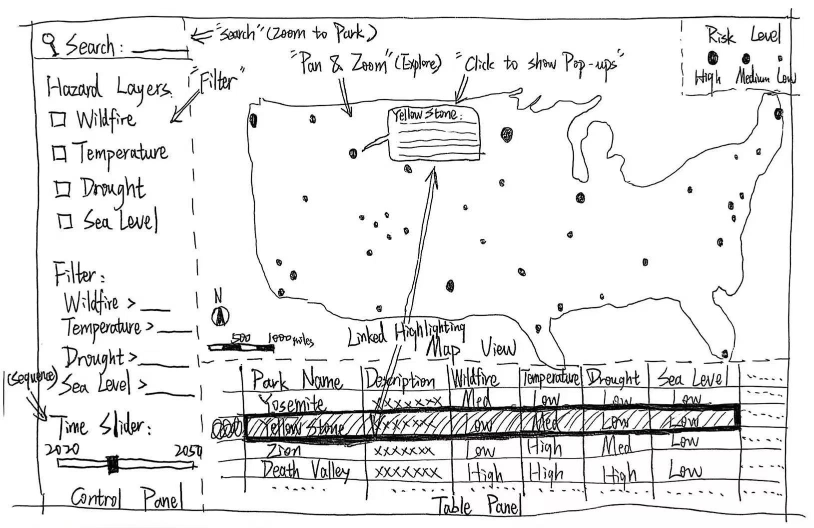
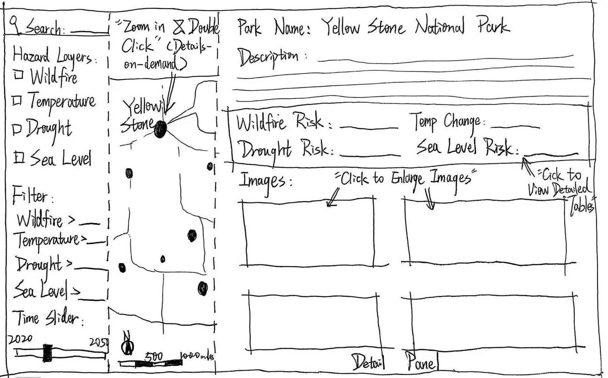
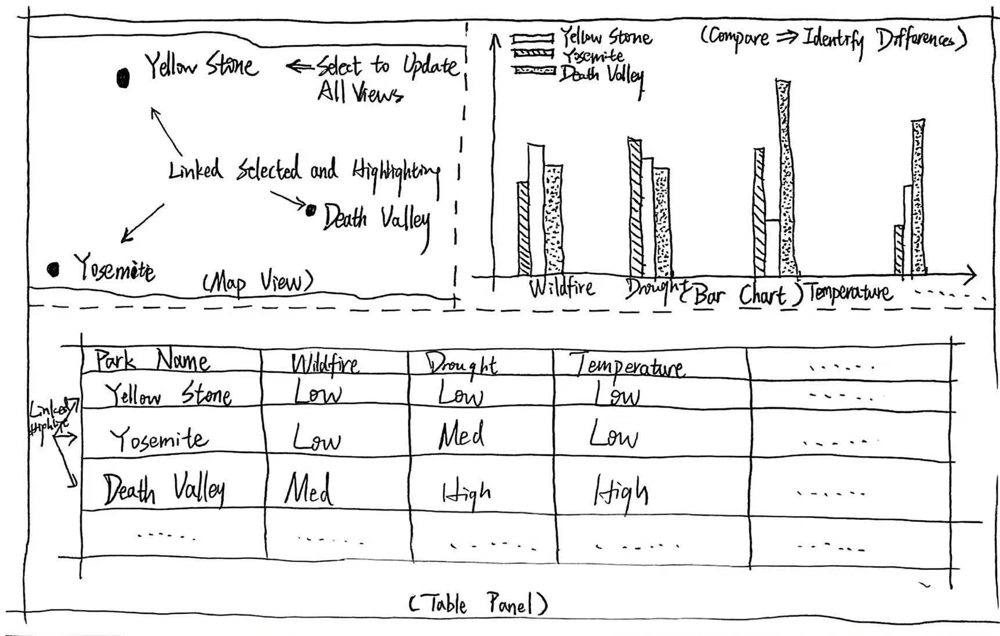

575 Final Project Proposal
1. Project Title & Group Members
Title: Visualizing Climate Risks Across U.S. National Parks
Group Members: Yilun Zhao, Siming Li

2. Background Description
Lee is an environmental planner working at a regional planning agency focused on climate resilience and land management. Her responsibilities include assessing environmental risks in national parks and developing adaptation strategies that balance ecological conservation with public access. Lee has a strong professional background in environmental science and policy, but her technical skills in Geographic Information Systems (GIS) and data analysis are only moderate—she can interpret spatial data and use basic tools, but she is not a programming expert.
Lee frequently works with various datasets related to climate-related hazards, such as wildfire risk, temperature forecasts, and drought indices. However, these datasets are often stored in different formats and on different platforms, making it difficult for her to gain a comprehensive understanding of how different risks overlap in space and time.
In addition to her analytical work, Lee is responsible for preparing reports and presentations for policymakers and the public. For this reason, she places a high value on tools that not only support data exploration but also provide clear visualizations and contextual information. For example, being able to display images of national parks alongside risk data would help her better convey the real-world impacts of climate change.
Lee's primary objectives are to efficiently identify high-risk national parks, understand the interactions among various climate hazards, and determine priority areas for intervention. She needs an intuitive, interactive visualization tool that allows her to dynamically explore data, compare different locations, and gain insights without requiring advanced technical expertise.

3. User Case Scenarios
Scenario #1: Identifying High-Risk National Parks
When Lee arrives at the website, she is presented with a map of the United States displaying national parks as point symbols and a control panel on the left. She immediately pans and zooms across regions to explore spatial patterns of climate risk. She uses the layer toggle to select wildfire risk, which reexpresses the map using a color gradient. She then clicks on several parks to identify their names and view detailed information in a side panel, including images of the park and associated risk metrics.
Lee then applies a filter to display only parks above a certain risk threshold, allowing her to focus on high-priority locations. She uses the search function to locate specific parks she is already familiar with. The selected parks are highlighted across the map and comparison panel through linked highlighting. A table at the bottom allows her to compare multiple parks and identify outliers at risk levels. 

Scenario #2: Multi-Hazard Comparison and Temporal Exploration
When Lee revisits the application, she sees the national map and control panel. She uses the layer toggle to activate multiple hazards, such as drought and temperature increase, which resymbolize the map and reveal areas where risks overlap. She then selects several parks of interest, which are highlighted across all coordinated views, including charts and tables.
Lee interacts with the time slider to explore how climate risks change over time, observing how certain parks become more vulnerable under future scenarios. She hovers over park points to preview summary information and then clicks to access detailed panels with images and contextual descriptions, helping her better interpret the environmental conditions of each park. Then she uses the comparison panel to rank and compare selected parks across multiple variables. Through brushing and linking, she focuses on a subset of parks and examines patterns across views. 

4. Requirements Document
Representation
1. Basemap: 
A U.S. basemap displaying state boundaries and geographic context. National parks are represented as point features positioned accurately across the country. 
2. National Park Features:
Each national park is represented as an interactive point symbol. Symbol color or size encodes an overall climate risk index, allowing users to quickly identify high-risk parks. 
3. Climate Hazard Layers:
Multiple climate hazard datasets will be represented, including: wildfire risk, temperature change, drought index. These variables will be visualized using choropleth-style color gradients or proportional symbols, allowing users to interpret spatial patterns and intensity.
4. Temporal Representation:
A temporal dimension will be incorporated using a time slider, allowing users to view historical data or projected future scenarios. 
5. Attribute Panel:
When a user selects a park, a side panel will display: park name and location, hazard-specific values, descriptive information and images of the park.
6. Comparison Panel:
A coordinated table or chart will display selected parks and their attributes, enabling side-by-side comparison across multiple variables.

Interaction
1. Zoom & Pan:
Users can pan and zoom to explore different national parks and scales. 
2. Click Selection:
Users can click on a park to: identify the park, view detailed attributes, view images of the park, highlight the park across coordinated views.
3. Hover Interaction:
Users can hover over park symbols to preview summary information such as name and key risk indicators. 
4. Layer Toggle:
Users can turn on/off different hazard layers, allowing exploration of individual or combined risks. 
5. Filter:
Users can filter parks based on: hazard type, risk thresholds, geographic region.
6. Time Slider:
Users can use a time slider to explore how climate risks change over time, supporting temporal analysis. 
7. Search:
Users can search for a specific park by name, which will highlight and center the map on that location. 
8. Comparison Selection:
Users can select multiple parks to compare attributes side-by-side in a table or chart view.
9. Linked Highlighting:
Selecting a park will highlight multiple views (map, table, charts).

5. Wireframe mock-ups of map solution

### Wireframe 1: Main Exploration View

### Wireframe 2: Park Detail View

### Wireframe 3: Comparison View

